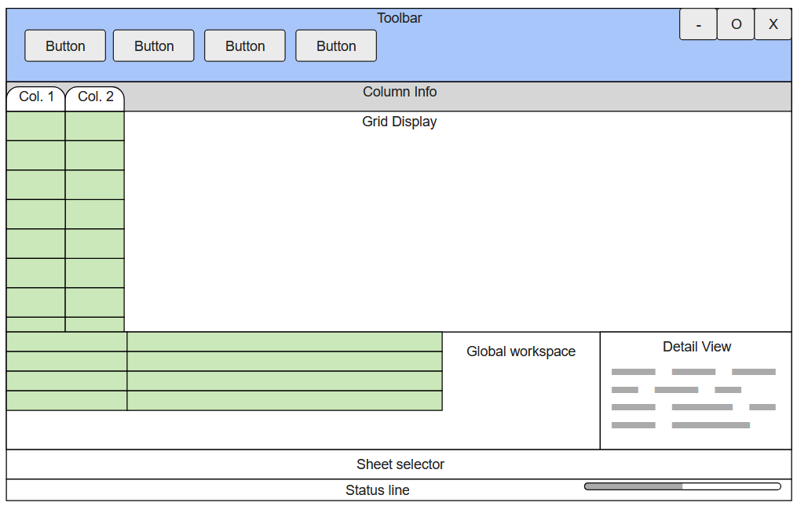

# Boxed

A clone of excel, written in Rust.

Designed to be a simple demo, not a full-featured spreadsheet.

Based on a column-oriented data model.

Planned features include:

- Strongly, statically typed expressions and values
  - No ambiguous types for columns
  - No implicit type conversions
- Dependency tracking
  - Columns can depend on other columns (potentially from other sheets)
- A simple grid display
  - Cell display
  - A workspace for global calculations
    - Simple key:value pairs (like a dictionary)
    - Capable of evaluating expressions and using column references
- Save and load functionality
  - Custom binary format
    - Based (very loosely) on the Parquet format
  - CSV export
  - No support for Excel files (ISO 29500) due to complexity

Possible features include:

- A simple formula editor
- Assistants for common tasks (formula verification/debugging, etc.)

## Roadmap

- [ ] Expressions
  - [x] Formal Grammar
  - [x] Parsing
  - [ ] Evaluation
    - [ ] Arithmetic
    - [ ] Functions
    - [ ] Column References
  - [ ] Type Checking
    - [ ] Arithmetic
    - [ ] Functions
    - [ ] Column References
- [ ] Cells
  - [ ] Values
  - [ ] Expressions
  - [ ] Dependencies
- [ ] Display
  - [ ] Grid
  - [ ] Decorations
  - [ ] Toolbar
  - [ ] Status Bar
  - [ ] Workspace
- [ ] Workspace
  - [ ] Key:Value Pairs
  - [ ] Expressions
  - [ ] Column References
- [ ] File I/O
  - [ ] Save
  - [ ] Load
  - [ ] Export
  - [ ] Save Format
    - [ ] Binary
    - [ ] CSV

## UI Mockup

## License

This project is entirely a personal project, and as such follows the terms of the Unlicense. See the [LICENSE](./LICENSE) file for more information.

It is intended as a test of my abilities and a demonstration of my skills, and is not intended for any other purpose.
